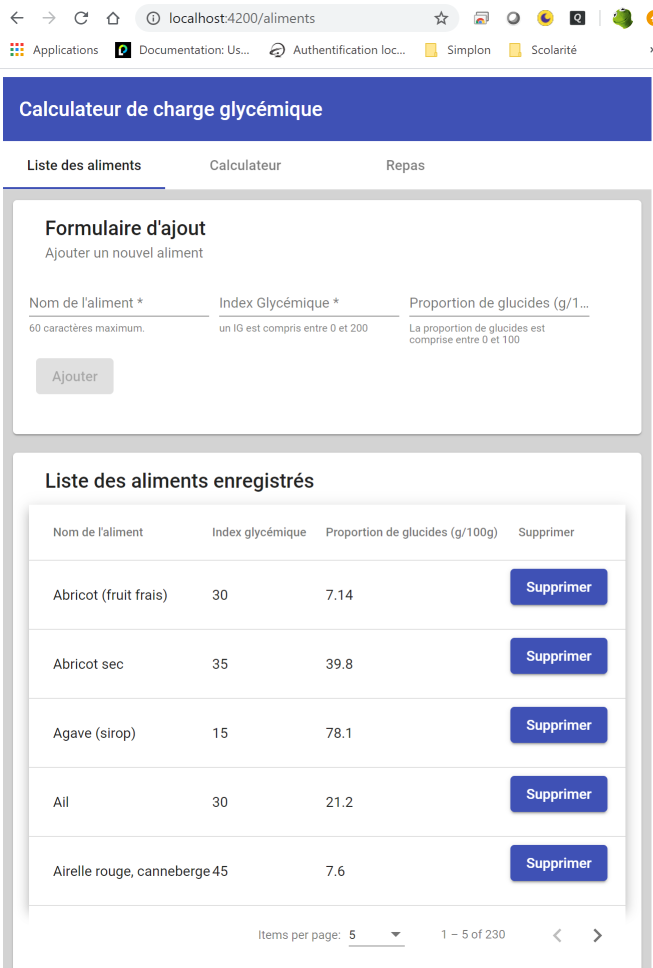

# Description rapide
Développez une application web et web mobile de calcul de la charge glycémique !

**Index :**

* [Énoncé du brief](#a_01)
* [Détail du rendu](#a_02)

## Énoncé du brief

De nos jours on peut vérifier si un aliment est bon où non pour la santé avec des applications (avec [Yuka](https://yuka.io/)  par exemple).

Mais on ne peut pas calculer la charge glycémique d'un repas. Et c'est très important car ça a un impact sur la santé aussi ! La réponse du corps à l'ingestion de glucides peut se quantifier avec l'index glycémique et la charge glycémique. L'index glycémique d'un aliment correspond (en très simplifié) à la vitesse avec laquelle le corps va produire de l'insuline pour réagir aux glucides présents dans les aliments. Cet index est indépendant de la quantité d'aliment que l'on ingère. La charge glycémique quant à elle prend en compte la quantité d'aliment que l'on va ingérer et donne une indication plus précise de l'impact de notre assiette sur sécrétion d'insuline.

**On définit la charge glycémique comme suit :** CG = (IG de l'aliment x quantité de glucides dans la portion d'aliment) / 100

**Votre mission si vous l'acceptez :** Réaliser une application web simple qui permet de :

**MVP :**

* Consulter une liste d'aliments simple et leur index glycémique associé.

* Calculer la charge glycémique d'un repas en combinant des portions d'aliments se trouvant dans la liste.

**Bonus 1 : Une application plus sympa à utiliser**
* Ajoutez des validateurs sur le formulaire aliment (un IG est compris entre 0 et 200, une proportion de glucide entre 0 et 100).

* Ajoutez des validateurs sur le formulaire de calcul
Formattez proprement les chiffres à virgule avec des pipes.

* Triez la liste de sélection d'aliment par ordre alphabétique.

* Proposez des tris du tableau sur chaque colonne.

**Bonus 2 : Une application qui garde la mémoire**

* Proposez d'enregistrer le résultat de votre calcul sous forme de repas.

* Sauvegardez toutes les données dans le local storage.

* Créez un composant pour affichez la liste des repas enregistrés.

## Détail du rendu

### Installation

Afin de pouvoir compiler le projet, les frameworks [Angular CLI](https://angular.io/) version 8.3.19 et [Angular Material](https://material.angular.io/) version 8.2.3 doivent être installés dans l'environnement de développement.

### Contenu du rendu

Tous les attendus du MVP ainsi que les deux bonus sont présents dans le rendu.

* **Saisie des aliments**

* **Calculateur de portions**

* **Enregistrement d'un repas**

* **Liste des repas**

* **Détail d'un repas**

